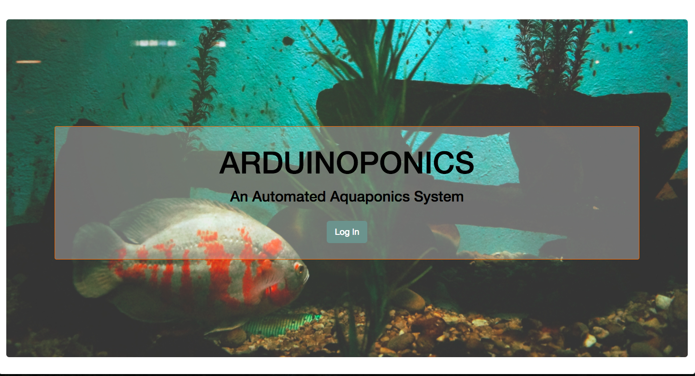

# ARDUINOPONICS

Arduinoponics is a prototype of an automated aquaponics* system. It uses a Raspberry Pi and an Arduino with environmental sensors to collect data from the system before displaying that data through a web browser interface via Socket.io. Additionally, I use Twilio to notify the system administrator through text messaging if the system is operating outside of specific parameters.

## Tech Used:
* Node.js
* Express.js
* Socket.io
* React.js
* Johnny-Five.js
* Brunch
* Passport
* Arduino Uno
* Debian (Raspberry OS)
* Twilio

## Hardware:
 * Raspberry Pi 3 Model B
 * Arduino Mega
 * Arduino Uno
 * resistors
 * breadboard
 * 12V 6A DC power supply
 * Air humidity and temp sensor (HIH6130)
 * DS18B20 Temperature Sensor - Waterproof Digital Thermal Probe Sensor
 * BPM280 Breakout Board - Thermometer/Hydrometer

## Next Steps:
 * Add DO, and Ph sensor
 * Expand system to include larger volume of grow media and water
 * Add relays to control lights
 * Persist sample system data - graphically display system status over time
 * Incorporate an image in system alert MMS

* Aquaponics - a system of aquaculture in which the waste produced by farmed fish or other aquatic animals supplies nutrients for plants grown hydroponically, which in turn purifies the water
